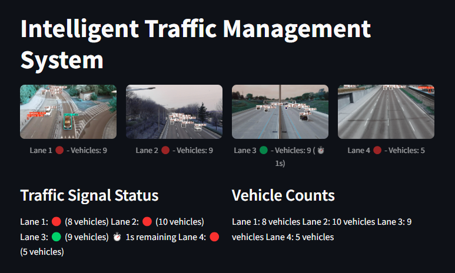

# Intelligent Traffic Management System



## Overview
This project implements an intelligent traffic management system using computer vision and deep learning. The system analyzes real-time video feeds from multiple lanes, counts vehicles, and dynamically adjusts traffic signal timings based on traffic density.

## Features
- Real-time vehicle detection using YOLOv8
- Dynamic traffic signal timing based on vehicle density
- Visual countdown timer for green signals
- Multi-lane traffic monitoring (supports 4 lanes)
- Live vehicle count display
- Streamlit-based user interface

## Prerequisites
- Python 3.8 or higher
- CUDA-capable GPU (recommended for optimal performance)

## Installation

1. Clone the repository:
```bash
git clone https://github.com/yourusername/traffic-management-system.git
cd traffic-management-system
```

2. Create and activate a virtual environment (recommended):
```bash
python -m venv venv
# On Windows
venv\Scripts\activate
# On Linux/Mac
source venv/bin/activate
```

3. Install required packages:
```bash
pip install -r requirements.txt
```

## Required Files
- Video files for each lane:
  - `lane1.mp4`
  - `lane2.mp4`
  - `lane3.mp4`
  - `lane4.mp4`
- YOLOv8 model file (will be downloaded automatically on first run)

## Usage

1. Place your video files in the project directory
2. Run the application:
```bash
streamlit run traffic_management.py
```

3. Access the interface through your web browser at `http://localhost:8501`

## System Components

### Vehicle Detection
- Uses YOLOv8 for real-time vehicle detection
- Supports detection of cars, motorcycles, buses, and trucks
- Provides accurate vehicle counting for each lane

### Traffic Signal Management
- Minimum green signal duration: 5 seconds
- Maximum green signal duration: 30 seconds
- Dynamic timing based on vehicle count
- Smooth transitions between signals

### User Interface
- Live video feeds from all lanes
- Real-time vehicle counts
- Traffic signal status indicators
- Countdown timer for current green signal
- Vehicle density statistics

## Configuration

You can modify the following parameters in `traffic_management.py`:

```python
# Traffic Signal Parameters
min_green_duration = 5    # Minimum green light duration
max_green_duration = 30   # Maximum green light duration
vehicles_per_second = 2   # Average vehicles that can pass per second
```

## Performance Optimization

For optimal performance:
1. Use a GPU for faster inference
2. Adjust video resolution if needed
3. Modify the frame rate in the main loop if necessary

## Troubleshooting

Common issues and solutions:

1. Video feed not loading
   - Check if video files exist in the correct directory
   - Verify video file format compatibility

2. Slow performance
   - Ensure GPU is properly configured
   - Reduce video resolution if necessary
   - Check system resource usage

3. YOLOv8 model errors
   - Verify internet connection for first-time model download
   - Check CUDA installation if using GPU

## Contributing
Contributions are welcome! Please feel free to submit a Pull Request.

## License
This project is licensed under the MIT License - see the LICENSE file for details.

## Acknowledgments
- YOLOv8 by Ultralytics
- OpenCV community
- Streamlit team

## Contact
For any queries or suggestions, please reach out to [your contact information].
